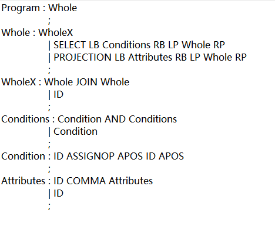
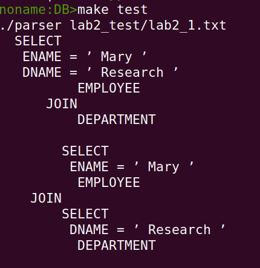

# 哈工大2023年春季学期数据库实验三部分代码
## 1、涉及部分  
&emsp;这部分为实验三中二选一其中一个（有两个任务的实验）的第二部分。要求是实现识别SQL语句，并进行优化。本次选择识别前三条语句  
## 2、实现背景  
&emsp;因为本学期也在学习编译原理，考虑到这实际上就是词法、语法、语义识别的过程，我选择使用编译原理课上已经给出的工具。这两个工具分别是 *flex* 与 *bison*  
&emsp;这么做某种程度上减少了工作，但思考的方向也会大大改变，因为它意味着要自己设计语法产生式。  
&emsp;如果你也想要这么做，可以参照本文的思路。当然，前提是你在学或者学过了编译原理。我会把这两件工具的相关指导书放在仓库中，或许你会用到

## 3、实现思路  
&emsp;词法分析部分，*token* 只需要自行拆分；语法与语义分析则参考之前课程实现的方法，唯一需要注意的是要自行设计产生式。下图为所选择的前三条 *SQL* 语句对应的产生式，它仍存在一处冲突，但不影响使用  
&emsp;  
&emsp;优化过程也很简单。因为 *bison* 已经生成了语法树（虽然树结点的类型需要自己设置），所以只需要在结点上稍作修改即可。这种操作并不难  
&emsp;最后是可视化输出的部分。你可以参考我的代码，具体如何展现可以根据你的想法自行修改。  
&emsp;  

## 4、使用说明
&emsp;只需要打开终端输入 *make test* 即可。要使程序能识别其他 *SQL* 语句，你需要对产生式、*token* 等进行修改，还需要修改 *lab2_test* 中的文本内容。
